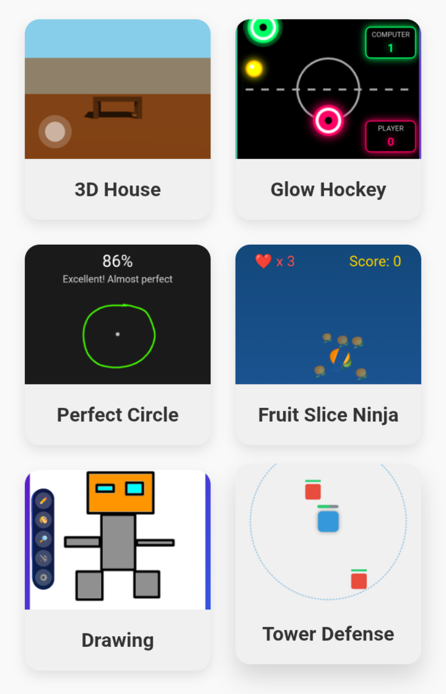

# AGameRepo

**AGameRepo** is a repository containing games developed with *HTML, CSS, and JavaScript*. All games are built using **Canvas** and are released under the **MIT License**. While the games can be played on PC, most of them are specifically optimized for mobile devices.

### Game Screenshot
 

# Usage
- Open the `index.html` file in the root directory to view all games in the project.
- To access the source code of a specific game, simply open its corresponding folder.

## License
This project is licensed under the MIT License - see the [LICENSE](LICENSE) file for details.

---

Developer: Ferhat Gönültaş